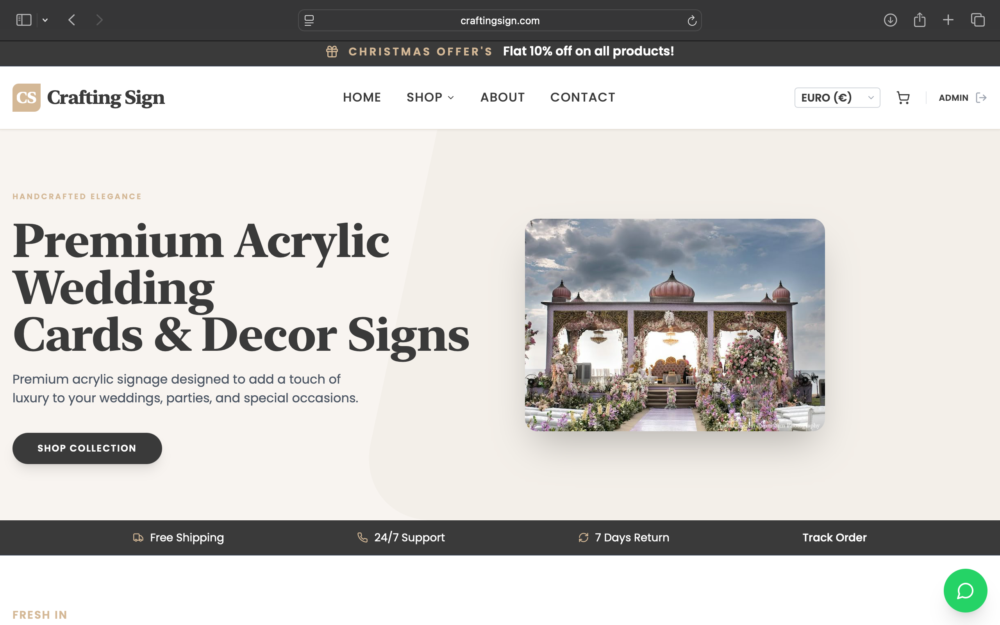
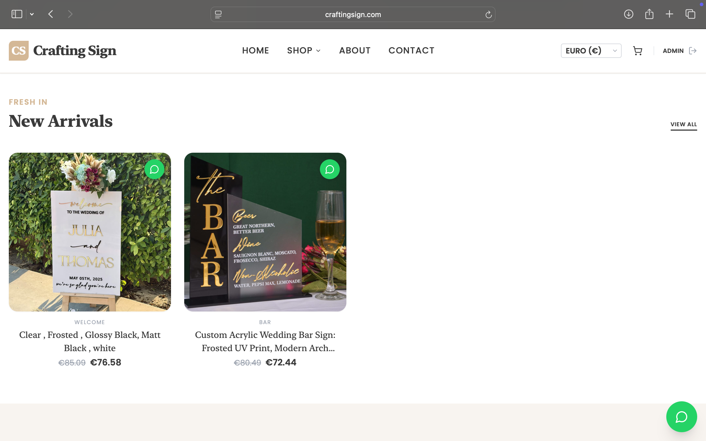
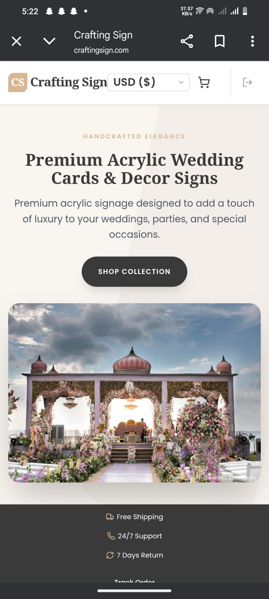
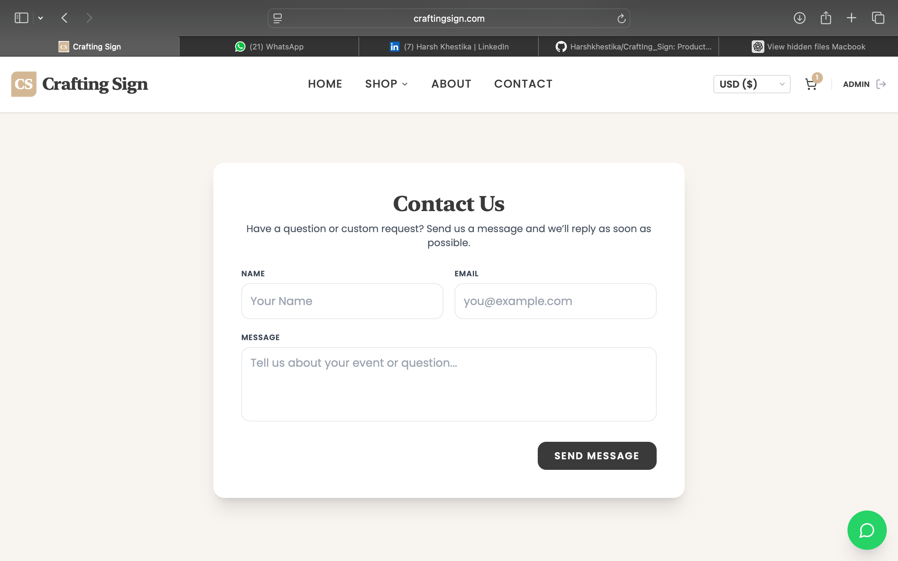

# 🌐 CraftingSign – MERN Stack Web Application


**CraftingSign** is a **production-ready MERN stack web application** designed to showcase and manage **premium acrylic signage and custom event card designs** for weddings, corporate events, birthdays, and other celebrations.  
The platform serves **both Indian and international clients**, focusing on **performance, clean UI/UX, and scalable architecture**.

🔗 **Live Website:** https://craftingsign.com  

---

## 🚀 Features

- 🎨 **Modern & Responsive UI**
- 🪧 **Event Signage & Card Collections**
- ⚡ **Fast Image Loading with Cloudinary**
- 🌍 **International Client Support**
- 📱 **Mobile-First Design**
- ☁️ **Cloud-Deployed & Production-Ready**

---

## 🛠️ Tech Stack

### Frontend
- **React.js**
- **HTML5, CSS3, JavaScript**
- **Tailwind CSS**

### Backend
- **Node.js**
- **Express.js**
- **MongoDB**

### Deployment & Tools
- **DigitalOcean** – Backend Hosting
- **Netlify** – Frontend Deployment
- **Cloudinary** – Image & Media Storage
- **Spaceship** – Domain Management

---

## 📸 Screenshots

> Create a folder named **`screenshots/`** in the project root.

### 🏠 Home Page


### 🪧 Product Collections


### 📱 Responsive / Mobile View


### 📩 Contact / Inquiry Page


---

## 🧠 My Role

This project was developed as a **group project**, and I worked on:

- **End-to-end full-stack development**
- **Frontend UI using React**
- **Backend APIs & MongoDB integration**
- **Cloud deployment & production setup**
- **Media optimization & performance handling**

---

## 📂 Project Structure

craftingsign/
│── frontend/
│── backend/
│── screenshots/
│── .gitignore
│── README.md
│── package.json

---

## ⚙️ Installation & Setup

### **1️⃣ Clone the Repository**
```bash```
⚬git clone https://github.com/your-username/craftingsign.git
⚬cd craftingsign

### **2️⃣ Frontend Setup**
```bash```
⚬cd frontend
⚬npm install        # Install dependencies
⚬npm start          # Run the development server
**💡 The frontend will run on http://localhost:3000 by default.**

### **3️⃣ Backend Setup**
```bash```
⚬cd backend
⚬npm install        # Install dependencies
⚬npm run dev        # Run the backend server
**💡 The backend API will run on http://localhost:5000 by default (or the port defined in .env).**

### **4️⃣ Environment Variables**
**Create a .env file inside the backend/ folder and add:**
```env```
MONGO_URI=your_mongodb_connection_string
CLOUDINARY_CLOUD_NAME=your_cloud_name
CLOUDINARY_API_KEY=your_api_key
CLOUDINARY_API_SECRET=your_api_secret

### **5️⃣ Running the Full Application**
1. Start the backend server (npm run dev in backend/)
2. Start the frontend server (npm start in frontend/)
3. Open your browser and visit: http://localhost:3000

🎓 Learning Outcomes
✅ Built a real-world MERN stack application
✅ Gained hands-on experience with cloud deployment
✅ Designed scalable backend APIs
✅ Improved production-level development skills
✅ Worked in a collaborative team environment

👨‍💻 Author
Harsh Khestika
Full-Stack MERN Developer
💼 LinkedIn: https://www.linkedin.com/in/harsh-khestika-36533a298/ 

⭐ Acknowledgements
This project was developed under the guidance of my institute, as part of an academic and practical learning experience.
